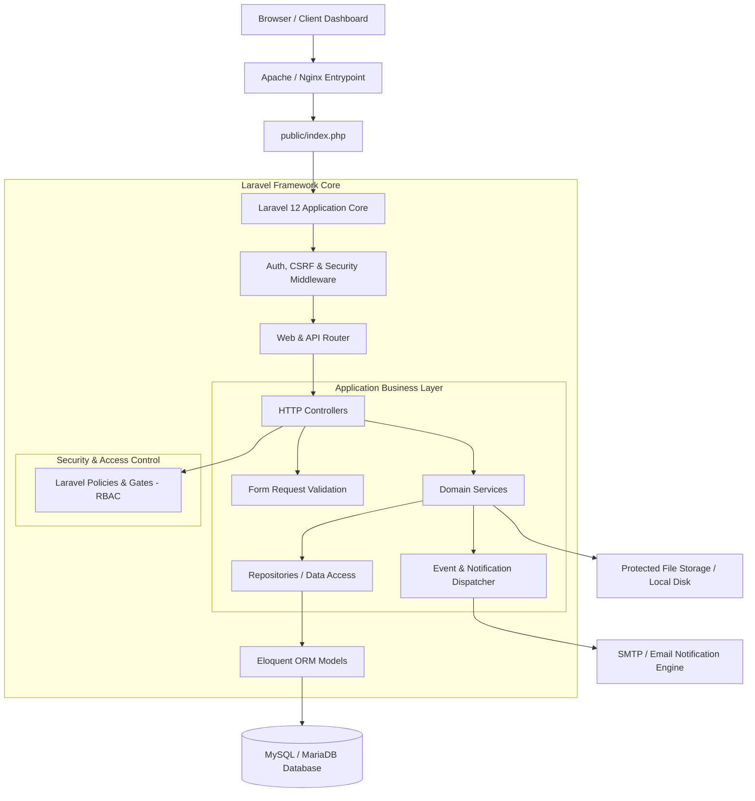

# GM Code Lab — Technical & System Architecture

## 1. Executive Summary

This document outlines the system architecture for the **GM Code Lab** enterprise platform. The architecture is designed to be **modular, secure, performant, and scalable** while remaining fully compatible with standard PHP/MySQL environments such as **Hostinger shared hosting**.

---

## 2. Architectural Blueprint



---

## 3. Key Design Principles & Modular Structure

### 3.1 Layered Architecture
To prevent controller bloat and ensure high maintainability, the application strictly separates concerns into discrete software layers:

1. **HTTP Layer (`app/Http/Controllers`)**: Handles HTTP requests, triggers authorization checks, delegates execution to domain services, and returns views or API responses.
2. **Validation Layer (`app/Http/Requests`)**: Encapsulates incoming request validation rules and initial request authorization.
3. **Domain Service Layer (`app/Services`)**: Contains pure business logic (e.g., dynamic quote calculation, invoice generation, project status progression).
4. **Data Repository Layer (`app/Repositories`)**: Encapsulates database queries, keeping data access logic decoupled from business rules.
5. **Persistence Layer (`app/Models`)**: Eloquent models representing domain entities, relationships, scopes, and attributes.
6. **Authorization Layer (`app/Policies`)**: Granular authorization rules mapped to entities for Role-Based Access Control (RBAC).

### 3.2 Directory Structure Blueprint
```
app/
├── Enums/                 # Application state enums (Status, Priority, Roles)
├── Http/
│   ├── Controllers/       # Clean, lightweight controllers
│   ├── Middleware/        # Hostinger compatibility, security headers, RBAC
│   └── Requests/          # Dedicated form validation classes
├── Models/                # Eloquent models & relationship definitions
├── Policies/              # Access control policies for entities
├── Repositories/          # Data abstraction layer for Eloquent queries
├── Services/              # Core business logic processing engine
└── Providers/             # Application & Service Binding providers
```

---

## 4. Database Architecture & Schema Strategy

The database relies on **MySQL 8.0 / MariaDB** with strict relational integrity, indexed foreign keys, and UTF8MB4 character encoding.

### Core Entities & Relationships

| Entity Module | Primary Table | Key Foreign Keys & Relations |
| :--- | :--- | :--- |
| **Identity & RBAC** | `users`, `roles`, `permissions`, `model_has_roles` | Linked via pivot tables for flexible permission management |
| **CRM & Leads** | `leads`, `lead_activities` | `user_id` (assigned manager), `lead_id` |
| **Quotes & Proposals** | `quotes`, `quote_items` | `lead_id`, `client_id`, `created_by` |
| **Projects & Tasks** | `projects`, `milestones`, `tasks` | `client_id`, `quote_id`, `project_id`, `milestone_id` |
| **Billing & Finance** | `invoices`, `invoice_items`, `payments` | `project_id`, `client_id`, `milestone_id`, `coupon_id` |
| **Promotions** | `coupons`, `coupon_usages` | `coupon_id`, `client_id`, `invoice_id` |
| **Support & Tickets** | `tickets`, `ticket_messages` | `client_id`, `project_id`, `assigned_to` |
| **Content Management**| `services`, `portfolio_items` | Self-contained CMS items with slug indexing |

---

## 5. Security & Authorization Architecture

1. **Role-Based Access Control (RBAC)**:
   - Built using standard Laravel Gate & Policy infrastructure.
   - Roles: `Super Admin`, `Project Manager`, `Finance Lead`, `Support Specialist`, `Client`.
   - Every resource controller method is guarded by `$this->authorize()` or Policy middleware.

2. **Data & Request Protection**:
   - **SQL Injection**: Handled natively by PDO parameter binding through Eloquent ORM.
   - **XSS**: Automatic HTML entity escaping via Blade templating (`{{ $value }}`).
   - **CSRF**: Token validation required on all state-mutating requests (`POST`, `PUT`, `PATCH`, `DELETE`).
   - **File Upload Security**: Uploads validated by mime-type and stored outside the public web root in `storage/app/protected`. File delivery handled via authorized streaming endpoints.

---

## 6. Hostinger Shared Hosting Deployment Strategy

Hostinger shared hosting environments typically restrict root directory structure and SSH terminal access. To ensure 100% compatibility:

1. **Web Root Configuration**:
   - The application maintains standard Laravel structure where `/public` serves as the document root.
   - For Hostinger `public_html` setups, a symbolic link or standard root `.htaccess` redirect routes traffic securely to the `public/` directory without moving core application files outside their package structure.

2. **Environment & Caching Configuration**:
   - Configuration settings stored strictly in `.env`.
   - Optimized production performance using artisan commands:
     - `php artisan config:cache`
     - `php artisan route:cache`
     - `php artisan view:cache`

3. **Database Connectivity**:
   - Configured for standard MySQL sockets or TCP connection over `127.0.0.1:3306`.

---

## 7. Version Control & Development Workflow

- **Branching Model**:
  - `main`: Production-ready branch. Must remain stable and tested at all times.
  - `develop`: Primary integration branch for active development.
  - `feature/*`: Short-lived feature branches created off `develop` and merged via Pull Requests/Code Reviews.
- **Commit Guidelines**:
  - Conventional commit prefixes (`feat:`, `fix:`, `docs:`, `chore:`, `refactor:`).
