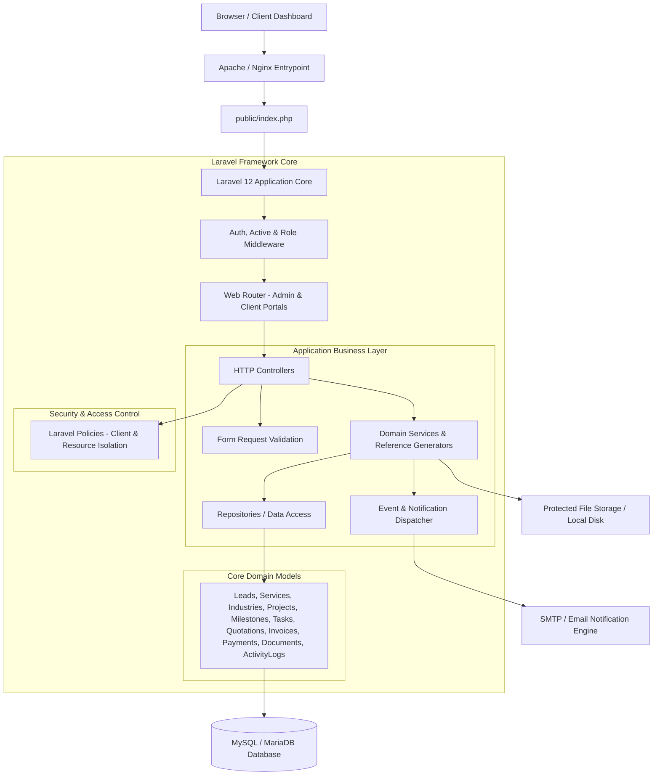

# GM Code Lab — Technical & System Architecture

## 1. Executive Summary

This document outlines the system architecture for the **GM Code Lab** enterprise platform. The architecture is designed to be **modular, secure, performant, and scalable** while remaining fully compatible with standard PHP/MySQL environments such as **Hostinger shared hosting**.

---

## 2. Architectural Blueprint



---

## 3. Key Design Principles & Modular Structure

### 3.1 Layered Architecture
To prevent controller bloat and ensure high maintainability, the application strictly separates concerns into discrete software layers:

1. **HTTP Layer (`app/Http/Controllers`)**: Handles HTTP requests for Admin and Client portals, triggers authorization checks, delegates execution to domain services, and returns views or API responses.
2. **Validation Layer (`app/Http/Requests`)**: Encapsulates incoming request validation rules and initial request authorization.
3. **Domain Service Layer (`app/Services`)**: Contains pure business logic and helper utilities (e.g., `ReferenceNumberGenerator`).
4. **Data Repository Layer (`app/Repositories`)**: Encapsulates database queries, keeping data access logic decoupled from business rules.
5. **Persistence Layer (`app/Models`)**: Eloquent models representing domain entities (`User`, `ClientProfile`, `Lead`, `Service`, `Industry`, `Project`, `ProjectRequirement`, `ProjectMilestone`, `Task`, `Quotation`, `QuotationItem`, `Offer`, `Invoice`, `Payment`, `Document`, `ActivityLog`).
6. **Authorization Layer (`app/Policies`)**: Granular authorization rules mapped to entities for Role-Based Access Control (RBAC) and cross-client tenant isolation.

### 3.2 Directory Structure Blueprint
```
app/
├── Console/
│   └── Commands/          # CLI management commands (admin:create)
├── Enums/                 # Application domain state enums (UserRole, UserStatus, LeadStatus, ProjectStatus, etc.)
├── Http/
│   ├── Controllers/       # Auth, Admin, and Client controllers
│   ├── Middleware/        # Hostinger compatibility, security headers, RBAC (EnsureUserHasRole, EnsureUserIsActive)
│   └── Requests/          # Dedicated form validation classes
├── Models/                # Core Eloquent models & relationship definitions
├── Policies/              # Access control policies (ClientProfilePolicy, etc.)
├── Repositories/          # Data abstraction layer for Eloquent queries
└── Services/              # Core business logic processing & reference generators (ReferenceNumberGenerator)
```

---

## 4. Database Architecture & Core Domain Schema (Phases 2 & 3)

The database relies on **MySQL 8.0 / MariaDB** with strict relational integrity, indexed foreign keys, `decimal(12,2)` precision for all monetary values, and UTF8MB4 character encoding.

### 4.1 Business Lifecycle Pipeline

```
Lead / Client Enquiry ──> Quotation ──> Project ──> Milestones & Tasks ──> Invoices ──> Payments ──> Documents & Delivery ──> Audit History
```

### 4.2 Core Implemented Entities

| Entity Module | Primary Table | Primary & Foreign Keys | Key Attributes & Unique Constraints |
| :--- | :--- | :--- | :--- |
| **Authentication & Accounts** | `users` | `id` (PK) | `email` (unique, index), `phone` (index), `role` (index), `status` (index), `password`, `email_verified_at`, `last_login_at` |
| **Client Business Information** | `client_profiles` | `id` (PK), `user_id` (FK, unique, cascade) | `company_name` (index), `contact_person`, `gst_vat_number`, `tax_id`, `industry`, `city`, `country` |
| **Leads / CRM** | `leads` | `id` (PK), `assigned_user_id` (FK, null), `client_id` (FK, null) | `reference_number` (unique, `GMC-LEAD-XXXXXX`), `name`, `email` (index), `phone` (index), `status` (index) |
| **Catalog Services** | `services` | `id` (PK) | `name`, `slug` (unique), `short_description`, `is_active` (index), `display_order` |
| **Industry Verticals** | `industries` | `id` (PK) | `name`, `slug` (unique), `description`, `is_active` (index), `display_order` |
| **Projects** | `projects` | `id` (PK), `client_id` (FK, cascade), `service_id` (FK, null), `industry_id` (FK, null) | `reference_number` (unique, `GMC-PROJ-XXXXXX`), `title`, `status` (index), `priority` (index), `estimated_value` (`decimal(12,2)`) |
| **Project Requirements** | `project_requirements` | `id` (PK), `project_id` (FK, cascade), `submitted_by_id` (FK, null) | `title`, `priority` (index), `status` (index), `attachments_metadata` (json) |
| **Project Milestones** | `project_milestones` | `id` (PK), `project_id` (FK, cascade) | `title`, `amount` (`decimal(12,2)`), `sequence_order`, `status` (index), `due_date`, `completed_date` |
| **Tasks** | `tasks` | `id` (PK), `project_id` (FK, cascade), `milestone_id` (FK, null), `assigned_user_id` (FK, null) | `title`, `status` (index), `priority` (index), `due_date`, `completed_date` |
| **Quotations** | `quotations` | `id` (PK), `client_id` (FK, cascade), `lead_id` (FK, null), `project_id` (FK, null) | `reference_number` (unique, `GMC-QUO-XXXXXX`), `issue_date`, `valid_until`, `subtotal`, `discount`, `tax`, `total` (`decimal(12,2)`), `status` (index) |
| **Quotation Line Items** | `quotation_items` | `id` (PK), `quotation_id` (FK, cascade), `service_id` (FK, null) | `description`, `quantity`, `unit_price`, `discount`, `tax`, `line_total` (`decimal(12,2)`), `sequence_order` |
| **Offers & Promotions** | `offers` | `id` (PK) | `name`, `code` (nullable, unique), `discount_type`, `discount_value` (`decimal(12,2)`), `minimum_project_value`, `starts_at`, `ends_at`, `is_active` (index) |
| **Offer Services Pivot** | `offer_services` | `id` (PK), `offer_id` (FK, cascade), `service_id` (FK, cascade) | Unique constraint `(offer_id, service_id)` |
| **Invoices** | `invoices` | `id` (PK), `client_id` (FK, cascade), `project_id` (FK, null), `quotation_id` (FK, null), `milestone_id` (FK, null) | `reference_number` (unique, `GMC-INV-XXXXXX`), `issue_date`, `due_date`, `subtotal`, `discount`, `tax`, `total`, `amount_paid`, `amount_due` (`decimal(12,2)`), `status` (index) |
| **Payments** | `payments` | `id` (PK), `client_id` (FK, cascade), `project_id` (FK, null), `quotation_id` (FK, null), `invoice_id` (FK, null), `milestone_id` (FK, null) | `reference_number` (unique, `GMC-PAY-XXXXXX`), `amount` (`decimal(12,2)`), `currency`, `payment_method`, `provider`, `provider_payment_id` (index), `status` (index) |
| **Document Metadata** | `documents` | `id` (PK), `client_id` (FK, null), `project_id` (FK, null), `uploaded_by_id` (FK, cascade) | `reference_number` (unique, `GMC-DOC-XXXXXX`), `document_type` (index), `original_filename`, `storage_path`, `mime_type`, `file_size`, `visibility` (index) |
| **Audit Logs** | `activity_logs` | `id` (PK), `actor_id` (FK, null) | `action` (index), `subject_type` (index), `subject_id` (index), `description`, `metadata` (json), `ip_address`, `user_agent`, `created_at` |

---

## 5. Reference Number Strategy

Unique public reference strings are generated automatically upon creation via `App\Services\ReferenceNumberGenerator`:
- **Leads**: `GMC-LEAD-000001`
- **Projects**: `GMC-PROJ-000001`
- **Quotations**: `GMC-QUO-000001`
- **Invoices**: `GMC-INV-000001`
- **Payments**: `GMC-PAY-000001`
- **Documents**: `GMC-DOC-000001`

Public references are backed by unique database indexes and are strictly segregated from primary auto-increment integer IDs (`id`).

---

## 6. Financial Precision & Calculations

- **No Floating-Point Columns**: All currency attributes utilize `decimal(12,2)` database fields.
- **Server-Side Recalculation**: Line items calculate `line_total = (quantity * unit_price) - discount + tax`. Quotations derive `subtotal`, `discount`, `tax`, and `total` server-side via `recalculateTotals()`.

---

## 7. Security & Tenant Data Isolation Architecture

1. **Role-Based Access Control (RBAC)**:
   - State Enums: `UserRole` (`admin`, `client`, `super_admin`, `project_manager`, `developer`, `finance`, `support`).
   - Provisioning: Clients register publicly (`/register`); Admin accounts provisioned strictly via CLI (`php artisan admin:create`).

2. **Tenant Data Isolation**:
   - Every client entity maps directly to `client_id` (`users.id` where role is `client`).
   - Eloquent relationships enforce strict separation between clients for Projects, Quotations, Invoices, Payments, Documents, and Requirements.

---

## 8. Hostinger Shared Hosting Deployment Strategy

1. **Web Root Configuration**: Standard Laravel structure with `/public` document root served via symbolic link or root `.htaccess`.
2. **Environment & Caching**: All config in `.env`; production optimization via `php artisan config:cache`, `route:cache`, `view:cache`.

---

## 9. Version Control & Development Workflow

- **Branching Model**: `main` (Production), `develop` (Integration).
- **Commit History**: Feature-based, meaningful commit messages (`feat: add core lead and catalog models`, `feat: add project and delivery domain models`, `feat: add quotation and billing models`, `feat: add offer and promotion foundation`, `feat: add document and activity audit models`, `test: add core domain relationship tests`, `docs: update core database architecture`).
