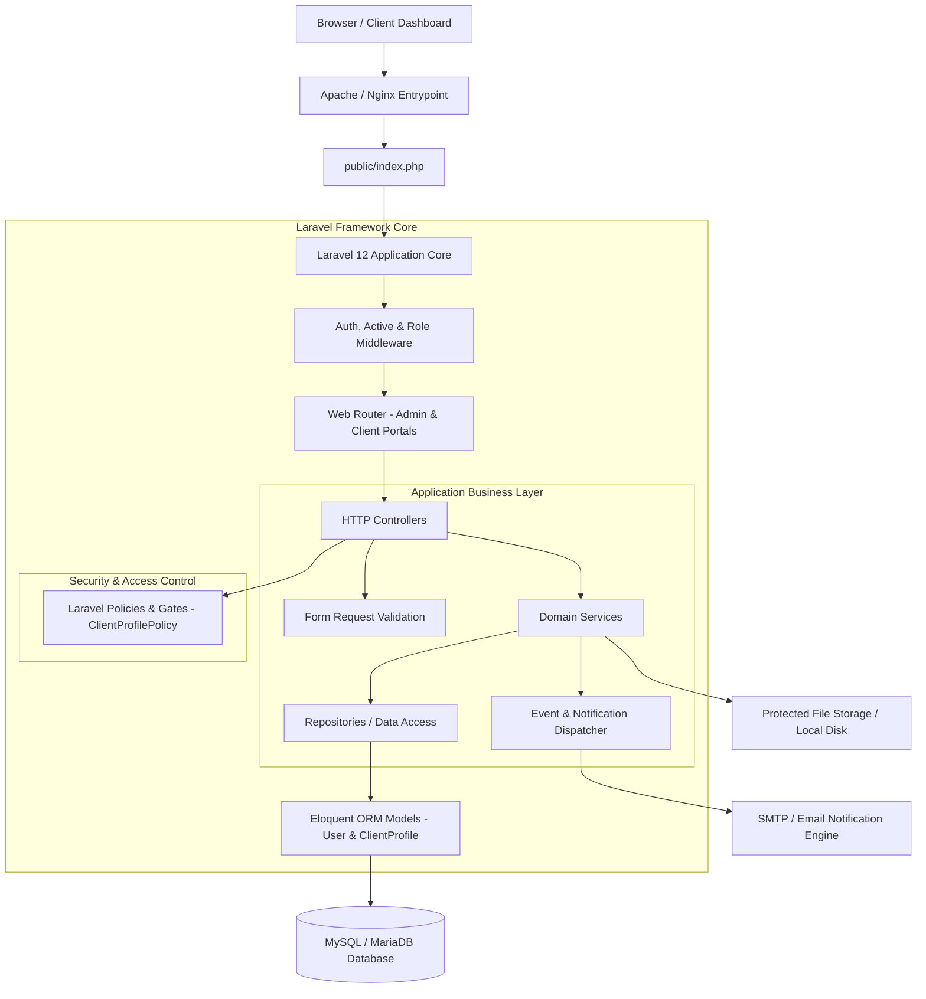

# GM Code Lab — Technical & System Architecture

## 1. Executive Summary

This document outlines the system architecture for the **GM Code Lab** enterprise platform. The architecture is designed to be **modular, secure, performant, and scalable** while remaining fully compatible with standard PHP/MySQL environments such as **Hostinger shared hosting**.

---

## 2. Architectural Blueprint



---

## 3. Key Design Principles & Modular Structure

### 3.1 Layered Architecture
To prevent controller bloat and ensure high maintainability, the application strictly separates concerns into discrete software layers:

1. **HTTP Layer (`app/Http/Controllers`)**: Handles HTTP requests for Admin and Client portals, triggers authorization checks, delegates execution to domain services, and returns views or API responses.
2. **Validation Layer (`app/Http/Requests`)**: Encapsulates incoming request validation rules and initial request authorization.
3. **Domain Service Layer (`app/Services`)**: Contains pure business logic.
4. **Data Repository Layer (`app/Repositories`)**: Encapsulates database queries, keeping data access logic decoupled from business rules.
5. **Persistence Layer (`app/Models`)**: Eloquent models (`User`, `ClientProfile`) representing domain entities, relationships, scopes, and attributes.
6. **Authorization Layer (`app/Policies`)**: Granular authorization rules mapped to entities for Role-Based Access Control (RBAC) and cross-client data isolation.

### 3.2 Directory Structure Blueprint
```
app/
├── Console/
│   └── Commands/          # CLI management commands (admin:create)
├── Enums/                 # Application state enums (UserRole, UserStatus)
├── Http/
│   ├── Controllers/       # Auth, Admin, and Client controllers
│   ├── Middleware/        # Hostinger compatibility, security headers, RBAC (EnsureUserHasRole, EnsureUserIsActive)
│   └── Requests/          # Dedicated form validation classes
├── Models/                # Eloquent models & relationship definitions (User, ClientProfile)
├── Policies/              # Access control policies (ClientProfilePolicy)
├── Repositories/          # Data abstraction layer for Eloquent queries
└── Services/              # Core business logic processing engine
```

---

## 4. Database Architecture & Schema Strategy

The database relies on **MySQL 8.0 / MariaDB** with strict relational integrity, indexed foreign keys, and UTF8MB4 character encoding.

### Core Implemented Entities (Phase 2)

| Entity Module | Primary Table | Primary & Foreign Keys | Key Attributes & Indexes |
| :--- | :--- | :--- | :--- |
| **Authentication & Accounts** | `users` | `id` (PK) | `email` (unique, index), `phone` (index), `role` (index), `status` (index), `password`, `email_verified_at`, `last_login_at` |
| **Client Business Information** | `client_profiles` | `id` (PK), `user_id` (FK, unique, cascade) | `company_name` (index), `contact_person`, `gst_vat_number`, `tax_id`, `industry`, `city`, `country` |
| **Session Protection** | `sessions` | `id` (PK) | `user_id` (index), `ip_address`, `last_activity` (index) |
| **Password Resets** | `password_reset_tokens` | `email` (PK) | `token`, `created_at` |

---

## 5. Security & Authorization Architecture

1. **Role-Based Access Control (RBAC)**:
   - Built using native Laravel Enums, Middlewares, and Policies.
   - Enums: `UserRole` (`admin`, `client`, `super_admin`, `project_manager`, `developer`, `finance`, `support`).
   - Portal Segregation:
     - Public client registration creates `client` role accounts only.
     - Administrative accounts (`admin`, `super_admin`) cannot be created publicly; provisioned interactively via CLI (`php artisan admin:create`).
     - Separate login endpoints: Client Login (`/login`) and Admin Login (`/admin/login`).

2. **Cross-Client Data Isolation**:
   - Enforced server-side via `ClientProfilePolicy`.
   - Client accounts are restricted to viewing/editing strictly their own profile (`$user->id === $clientProfile->user_id`).
   - Administrative accounts possess global view/edit permissions across profiles.

3. **Data & Request Protection**:
   - **Rate Limiting**: Throttling (`throttle:6,1`) applied to all login, registration, password reset, and verification endpoints.
   - **SQL Injection**: Handled natively by PDO parameter binding through Eloquent ORM.
   - **XSS**: Automatic HTML entity escaping via Blade templating (`{{ $value }}`).
   - **CSRF**: Token validation required on all state-mutating requests (`POST`, `PUT`, `PATCH`, `DELETE`).
   - **Session Protection**: Session ID regenerated on login, invalidated on logout, and cleared upon account deactivation/suspension.

---

## 6. Hostinger Shared Hosting Deployment Strategy

Hostinger shared hosting environments typically restrict root directory structure and SSH terminal access. To ensure 100% compatibility:

1. **Web Root Configuration**:
   - The application maintains standard Laravel structure where `/public` serves as the document root.
   - For Hostinger `public_html` setups, a symbolic link or standard root `.htaccess` redirect routes traffic securely to the `public/` directory without moving core application files outside their package structure.

2. **Environment & Caching Configuration**:
   - Configuration settings stored strictly in `.env`.
   - Optimized production performance using artisan commands:
     - `php artisan config:cache`
     - `php artisan route:cache`
     - `php artisan view:cache`

---

## 7. Version Control & Development Workflow

- **Branching Model**:
  - `main`: Production-ready branch. Must remain stable and tested at all times.
  - `develop`: Primary integration branch for active development.
- **Commit Guidelines**:
  - Feature-based, meaningful commit messages (`feat: add authentication foundation`, `feat: add role based authorization`, `feat: add client account foundation`, `test: add authentication and authorization tests`).
